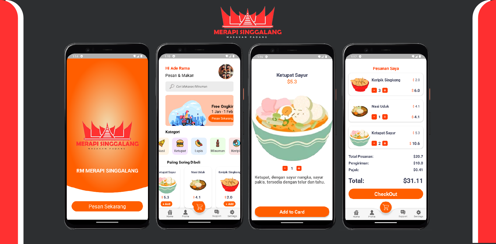

## Food Order APP

Aplikasi ini merupakan aplikasi mobile (android) untuk pemesanan makanan secara online. Dalam aplikasi ini, pengguna dapat mencari menu makanan, melihat detail menu makanan, memilih dan menentukan porsi makanan, kemudian checkout.
Untuk tema menu makanan yang saya pakai disini yaitu Rumah Makan Padang Merapi Singgalang, yang mana merupakan usaha milik orang tua saya dulu. Menu yang dijual yaitu Ketupat Sayur/Gulai Paku (Pakis), Lupis Ketan Padang, dan sebagai pelengkap Nasi Uduk/Nasi Kuning.
Selain itu terdapat cemilan seperti keripik singkong balado, dan gorengan tempe bakwan.

> ## Note
>
> Project ini merupakan tugas Ujian Akhir Semester (UAS) untuk mata kuliah Programming Mobile. Dimana project aplikasi ini menerapkan penggunaan fitur yang tersedia di android seperti checkbox, recyle view, layout, image view, text edit dan lain-lain.
> Aplikasi ini masih terbatas untuk digunakan dan masih akan dikembangkan kedepannya. Untuk update bisa cek link berikut [Update](https://github.com/aderamassxml/projectUAS).

## Download
